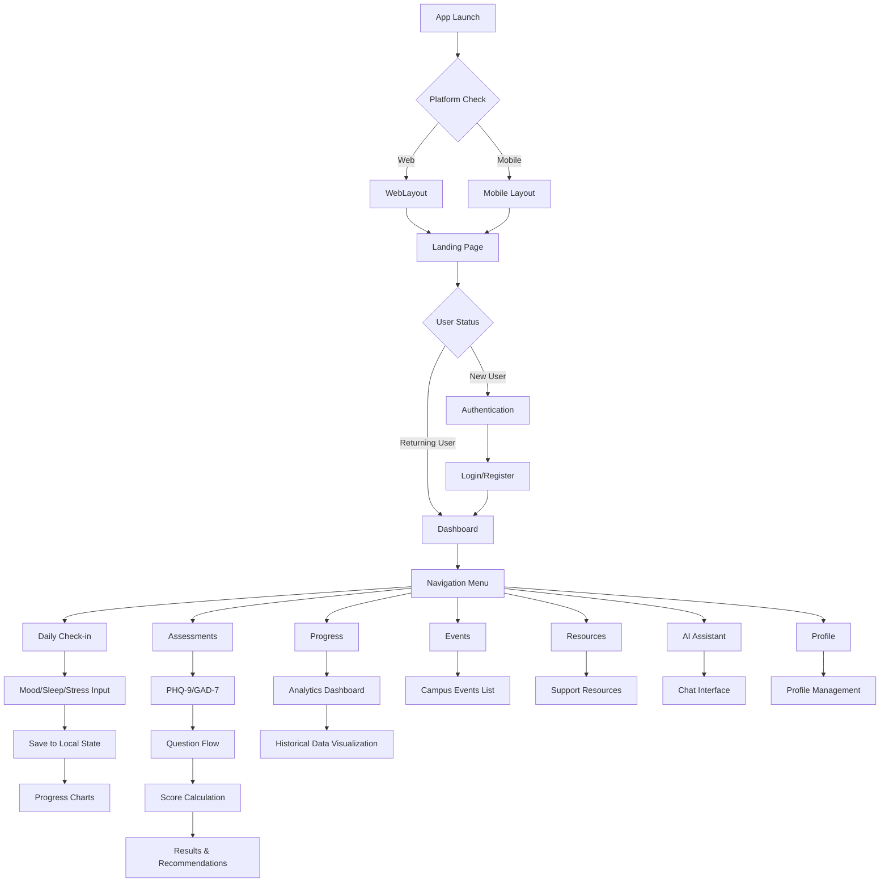
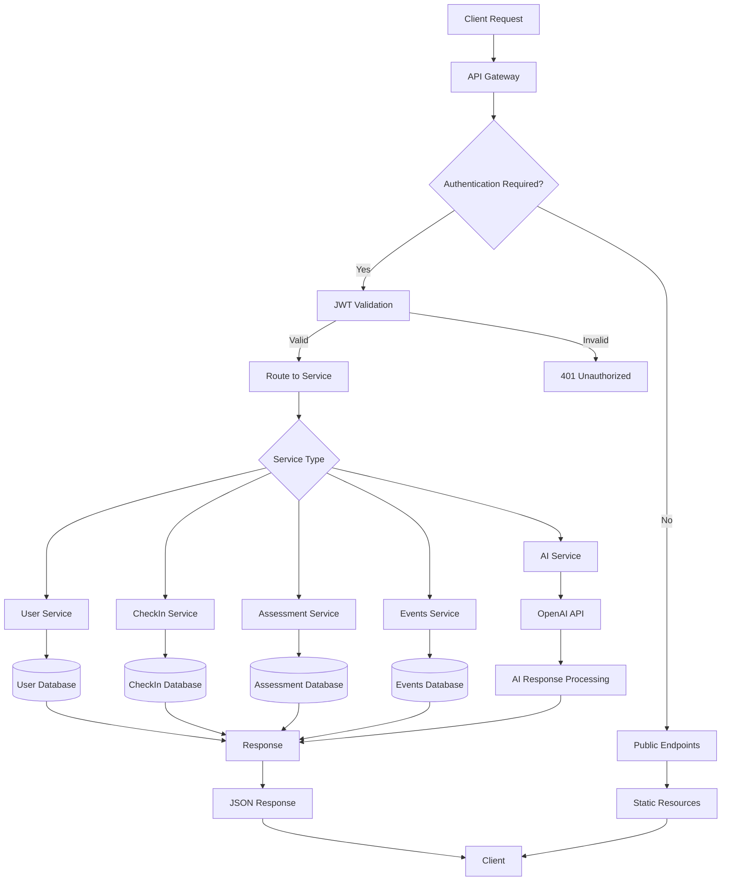
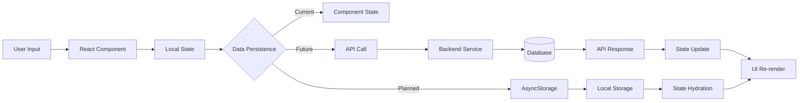

# WeGoToCalStateLA - Mental Health & Wellness Platform

## Project Overview

WeGoToCalStateLA is a comprehensive mental health and wellness platform designed specifically for California State University, Los Angeles students. The application provides tools for mental health assessment, daily wellness tracking, resources, and community support.

## Current Architecture

### Frontend Framework Stack

- **React Native**: Cross-platform mobile development
- **Expo**: Development platform and build system
- **Expo Router**: File-based routing system
- **React Native Web**: Web platform support
- **TypeScript**: Type safety and development experience
- **Lucide React Native**: Modern icon library
- **React Native Reanimated**: Advanced animations
- **Expo Linear Gradient**: Gradient backgrounds

### Design System

- **Custom Design System**: Modern design tokens with a focus on readability and accessibility
- **Typography Scale**: Comprehensive font sizing and weights
- **Spacing System**: 8px base unit spacing scale
- **Color Palette**: Semantic color system with primary, secondary, and status colors
- **Component Variants**: Standardized button, card, and input styles
- **Responsive Design**: Breakpoint-based responsive utilities
- **Shadow System**: Elevation-based shadows for mobile and web

### Current Features Implemented

#### ✅ Completed Features

1. **Landing Page**
   - Modern hero section with call-to-action
   - Feature highlights and testimonials
   - University branding integration
   - Responsive design for all devices

2. **Navigation & Layout**
   - WebLayout component with modern sidebar navigation
   - Responsive header with search and user menu
   - Mobile-first navigation patterns
   - Emergency support quick access

3. **Dashboard/Home Screen**
   - Personalized wellness dashboard
   - Quick action cards for assessments
   - Progress tracking widgets
   - Upcoming events and resources

4. **Daily Check-in System**
   - Mood tracking (1-5 scale)
   - Sleep quality assessment
   - Stress level monitoring
   - Progress visualization
   - Historical data charts

5. **Mental Health Assessments**
   - PHQ-9 (Depression screening)
   - GAD-7 (Anxiety screening)
   - Scoring algorithms and interpretations
   - Results with recommendations

6. **User Profile Management**
   - Profile information editing
   - Settings and preferences
   - Privacy controls
   - Account management

7. **Resources Section**
   - Campus mental health services
   - Emergency contacts
   - Support resources
   - Crisis intervention information

8. **Modern UI/UX**
   - Contemporary design language
   - Smooth animations and transitions
   - Accessibility considerations
   - Cross-platform consistency

#### 🚧 Partially Implemented Features

1. **Authentication System**
   - Login/signup UI components
   - Form validation
   - **Missing**: Backend authentication, session management

2. **AI Chat Assistant**
   - Chat interface UI
   - **Missing**: AI integration, conversation logic

3. **Events System**
   - Events listing UI
   - **Missing**: Event management, calendar integration

4. **Data Persistence**
   - Local state management
   - **Missing**: AsyncStorage integration, cloud sync

## Backend Architecture (Not Implemented)

### Required Backend Components

1. **Authentication Service**
   - User registration and login
   - JWT token management
   - Password reset functionality
   - Session management

2. **Database Schema**
   ```sql
   Users Table:
   - id, email, password_hash, first_name, last_name
   - created_at, updated_at, last_login
   - profile_data (JSON)
   
   DailyCheckIns Table:
   - id, user_id, date, mood_score, sleep_quality
   - stress_level, notes, created_at
   
   AssessmentResults Table:
   - id, user_id, assessment_type, score, responses
   - date_taken, created_at
   
   Events Table:
   - id, title, description, date, location
   - category, created_at, updated_at
   ```

3. **API Endpoints**
   ```
   Authentication:
   POST /api/auth/register
   POST /api/auth/login
   POST /api/auth/logout
   POST /api/auth/refresh
   
   User Management:
   GET /api/user/profile
   PUT /api/user/profile
   DELETE /api/user/account
   
   Daily Check-ins:
   GET /api/checkins
   POST /api/checkins
   GET /api/checkins/analytics
   
   Assessments:
   GET /api/assessments
   POST /api/assessments/submit
   GET /api/assessments/results
   
   Events:
   GET /api/events
   POST /api/events (admin)
   ```

4. **AI Integration**
   - OpenAI/Claude API integration
   - Conversation context management
   - Mental health response guidelines
   - Crisis detection and escalation

## Frontend Flow Chart



## Backend Flow Chart (Proposed)



## Data Flow Architecture



## Technology Comparison: Original vs Current Enhanced Version

### Original Project Architecture
**Backend Infrastructure:**
- **AWS Lambda**: Serverless computing for chatbot functionality
- **AWS Cognito**: User authentication and identity management
- **Amazon Cognito Identity Provider**: User pool management
- **AWS SDK**: Client-side AWS service integration
- **Multi-Factor Authentication**: Enhanced security features
- **JWT Tokens**: Session management

**Original Frontend Stack:**
- **React Native** (v0.76.7): Cross-platform mobile development
- **Expo** (v52.0.36): Development platform and build tools
- **React Navigation** (v7.x): Tab and stack navigation
- **NativeWind**: Utility-first CSS framework
- **AsyncStorage**: Local data persistence
- **i18next**: Internationalization support
- **Lottie React Native**: Animation support

**Original Key Features:**
- Full AWS backend integration
- Serverless chatbot with Lambda
- Secure authentication with Cognito
- Multi-language support
- Advanced animations with Lottie
- Over-the-air updates with Expo

### Current Enhanced Version
**Frontend-Only Architecture:**
- **React Native** (v0.79.5): Cross-platform mobile development
- **Expo** (v53.0.22): Development platform and build tools
- **React** (v19.0.0): Latest React version
- **TypeScript** (v5.8.3): Type safety and developer experience
- **Expo Router** (v5.1.5): File-based routing system
- **React Native Web** (v0.20.0): Web platform support
- **React Navigation** (v7.x): Tab and stack navigation
- **React Native Reanimated** (v3.17.4): Advanced animations
- **Lucide React Native** (v0.475.0): Modern icon library
- **Professional Design System**: Comprehensive design tokens
- **Cross-Platform**: Web and mobile support with responsive design
- **Scalable Architecture**: Modular component structure
- **Accessibility**: Better screen reader support and touch targets

**Key Improvements:**
- **Web Support**: Added React Native Web for browser compatibility
- **Modern Design**: Professional UI/UX with contemporary styling
- **TypeScript**: Enhanced type safety and developer experience
- **Responsive Design**: Breakpoint-based responsive utilities
- **Component Library**: Reusable design system components
- **Better Navigation**: Modern sidebar and header layout for web

### Architecture Comparison

| Aspect | Original Project | Current Enhanced Version |
|--------|------------------|-------------------------|
| **Backend** | ✅ Full AWS serverless | ❌ Frontend-only (needs implementation) |
| **Authentication** | ✅ AWS Cognito + MFA | ❌ UI only (needs backend) |
| **Chatbot** | ✅ AWS Lambda integration | ❌ UI only (needs AI integration) |
| **Data Storage** | ✅ AWS + AsyncStorage | ❌ Local state only |
| **Web Support** | ❌ Mobile-only | ✅ Full web compatibility |
| **Design System** | ❌ Basic styling | ✅ Professional design tokens |
| **TypeScript** | ❌ JavaScript only | ✅ Full TypeScript support |
| **Responsive Design** | ❌ Mobile-focused | ✅ Multi-device responsive |
| **Modern UI/UX** | ❌ Basic interface | ✅ Contemporary design |
| **Internationalization** | ✅ i18next support | ❌ Not implemented |

### What Was Enhanced
1. **Visual Design**: Complete redesign with modern aesthetics
2. **Web Platform**: Added full web browser support
3. **Type Safety**: Migrated to TypeScript for better development experience
4. **Component Architecture**: Built reusable design system
5. **Responsive Layout**: Multi-device compatibility
6. **Navigation**: Modern sidebar and header layout
7. **Performance**: Optimized animations and rendering

### What Needs to be Restored/Implemented
1. **Backend Services**: AWS Lambda functions for business logic
2. **Authentication**: AWS Cognito integration
3. **AI Chatbot**: Serverless chatbot functionality
4. **Data Persistence**: Real database integration
5. **Internationalization**: Multi-language support
6. **Security Features**: MFA and secure session management
7. **Cloud Deployment**: AWS infrastructure setup

## Remaining Tasks

### Critical Backend Implementation (Based on Original Architecture)

#### 1. **AWS Infrastructure Setup**
   - **AWS Lambda Functions**: Restore serverless chatbot functionality
   - **AWS Cognito**: Implement user authentication and identity management
   - **CloudWatch**: Set up logging and monitoring
   - **API Gateway**: Create secure API endpoints

#### 2. **Authentication & Security**
   - **Multi-Factor Authentication**: Implement MFA with AWS Cognito
   - **JWT Token Management**: Secure session handling
   - **Password Reset**: Secure password recovery process
   - **Email Verification**: Account validation system

#### 3. **AI Chatbot Restoration**
   - **Lambda Integration**: Serverless chatbot processing
   - **Natural Language Processing**: AI conversation capabilities
   - **Real-time Responses**: Immediate support and guidance
   - **Context Management**: Conversation state handling

#### 4. **Data Persistence & Storage**
   - **Database Schema**: User profiles, quiz results, daily check-ins
   - **AsyncStorage Integration**: Local data caching
   - **Data Synchronization**: Cloud and local data sync
   - **Privacy Controls**: Data protection and confidentiality

### Frontend Enhancements (Medium Priority)

#### 1. **Feature Restoration**
   - **Internationalization**: Restore i18next multi-language support
   - **Lottie Animations**: Add advanced animation support
   - **Over-the-Air Updates**: Implement Expo OTA updates
   - **Offline Support**: Add offline functionality

#### 2. **Mobile Optimization**
   - **Native Navigation**: Optimize React Navigation for mobile
   - **Performance**: Mobile-specific optimizations
   - **Push Notifications**: Add notification system
   - **Deep Linking**: Implement app deep linking

#### 3. **Web Platform Enhancements**
   - **SEO Optimization**: Add meta tags and structured data
   - **Progressive Web App**: PWA capabilities
   - **Browser Compatibility**: Cross-browser testing
   - **Web-specific Features**: Desktop-optimized interactions

### Integration Tasks (High Priority)

#### 1. **Frontend-Backend Connection**
   - **API Integration**: Connect frontend to AWS services
   - **Authentication Flow**: Integrate Cognito with UI
   - **Data Binding**: Connect forms to backend services
   - **Error Handling**: Comprehensive error management

#### 2. **Testing & Quality Assurance**
   - **Unit Testing**: Jest and React Native Testing Library
   - **Integration Testing**: API and component integration
   - **Cross-platform Testing**: iOS, Android, and Web
   - **User Acceptance Testing**: Student feedback validation

#### 3. **Deployment & DevOps**
   - **AWS Deployment**: Infrastructure as Code
   - **CI/CD Pipeline**: Automated build and deployment
   - **Environment Management**: Dev, staging, production
   - **Monitoring**: Application performance monitoring

### DevOps & Deployment (Based on Original Architecture)

#### 1. **AWS Infrastructure as Code**
   - **CloudFormation/CDK**: Infrastructure deployment automation
   - **Lambda Deployment**: Serverless function management
   - **Cognito Configuration**: User pool and identity provider setup
   - **API Gateway**: Endpoint configuration and security

#### 2. **Expo & React Native Deployment**
   - **EAS Build**: Cloud-based build service
   - **Over-the-Air Updates**: Code updates without app store submission
   - **App Store Distribution**: iOS App Store and Google Play Store
   - **Web Deployment**: Static site hosting for web version

#### 3. **Monitoring & Analytics**
   - **CloudWatch**: AWS service monitoring and logging
   - **Lambda Insights**: Serverless function performance
   - **Cognito Analytics**: User authentication metrics
   - **Application Performance**: Cross-platform monitoring

#### 4. **Compliance & Privacy**
   - **HIPAA compliance considerations**: Mental health data protection
   - **Privacy policy implementation**: Student data privacy
   - **Data retention policies**: Secure data lifecycle management
   - **Audit logging**: AWS CloudTrail integration

## File Structure

```
WeGoApp/
├── app/                          # Expo Router pages
│   ├── index.jsx                 # Landing page
│   ├── _layout.tsx               # Root layout
│   ├── +not-found.tsx           # 404 page
│   ├── authentication/          # Auth screens
│   ├── daily_check_in/          # Daily check-in flow
│   ├── home_screen/             # Dashboard and home
│   ├── profile/                 # User profile
│   ├── quizzes/                 # Mental health assessments
│   ├── resources/               # Support resources
│   └── chat_bot/                # AI assistant
├── components/                   # Reusable components
│   └── WebLayout.jsx            # Main layout wrapper
├── constant/                     # Design system and constants
│   ├── Colors.js                # Color palette
│   └── DesignSystem.js          # Design tokens
├── hooks/                       # Custom React hooks
│   └── useFrameworkReady.js     # Framework initialization
├── utils/                       # Utility functions
│   └── responsive.js            # Responsive design helpers
└── assets/                      # Static assets
```

## Deployment Status

- **Development**: ✅ Running locally with Expo
- **Web Build**: ✅ Configured for web deployment
- **Mobile Build**: ✅ Ready for iOS/Android builds
- **Backend**: ❌ Not implemented
- **Production**: ❌ Pending backend completion

## Next Steps & Implementation Priority

### Phase 1: Backend Infrastructure Restoration (Weeks 1-4)
1. **AWS Account Setup**
   - Configure AWS services (Lambda, Cognito, CloudWatch)
   - Set up development and production environments
   - Implement Infrastructure as Code

2. **Authentication System**
   - Restore AWS Cognito user pools
   - Implement MFA and security features
   - Connect frontend authentication flows

3. **Core Lambda Functions**
   - Restore chatbot Lambda function
   - Implement business logic endpoints
   - Set up API Gateway integration

### Phase 2: Data & AI Integration (Weeks 5-8)
1. **Database Implementation**
   - Set up data storage solution
   - Implement data models and schemas
   - Add data synchronization logic

2. **AI Chatbot Restoration**
   - Restore serverless chatbot functionality
   - Implement conversation management
   - Add mental health safety protocols

3. **Frontend-Backend Integration**
   - Connect all UI components to backend services
   - Implement proper error handling
   - Add loading states and offline support

### Phase 3: Feature Enhancement (Weeks 9-12)
1. **Mobile Optimization**
   - Restore native mobile features
   - Implement push notifications
   - Add deep linking support

2. **Internationalization**
   - Restore i18next multi-language support
   - Add language switching functionality
   - Implement RTL support if needed

3. **Advanced Features**
   - Lottie animations integration
   - Advanced analytics and insights
   - Export functionality for progress data

### Phase 4: Testing & Deployment (Weeks 13-16)
1. **Comprehensive Testing**
   - Unit and integration testing
   - Cross-platform compatibility testing
   - User acceptance testing with students

2. **Production Deployment**
   - AWS production environment setup
   - App store submission process
   - Web platform deployment

3. **Monitoring & Maintenance**
   - Set up comprehensive monitoring
   - Implement automated alerts
   - Create maintenance procedures

This documentation provides a comprehensive overview of the current state and future roadmap for the WeGoToCalStateLA mental health platform.